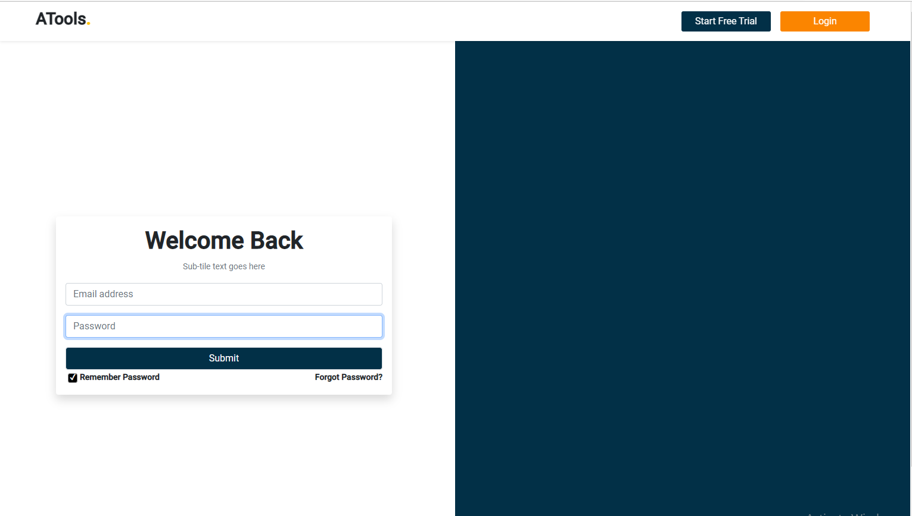

# ATools 

###  `Website:` [Link](https://cranky-ride-ceb14e.netlify.app/)
###  `Demo Video:` [YouTube](https://youtu.be/MgJ9kY9h30o)
###  `Code:` [GitHub](https://github.com/naeemmahmud70/vouch-digital)

##Features:
- Designed this webpage responsive based on the mock-up provided using
Bootstrap. 
 Simply cloned provided page using creative process considering the reusability of the elements. 
- Maked an API call on click of the login button and have been showed success/error message.
- After successful loggedIn user go to the entire page.

## Technology
- Html5
- Bootstrap5
- JavaScript
- ES6
- React.js
- React Router Dom
- React Hook Form